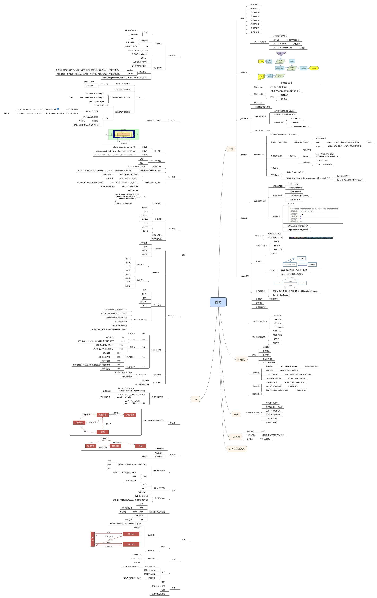

# 前端基础知识汇总

# [在线版](https://www.josephxia.com)

## 示例代码运行
- NodeJS 8.0 need https://nodejs.org/en/
- Clone or download this repository
Enter your local directory, and 
- install dependencies:
``` bash
npm install
npx live-server --open=./src

```

## 思维导图


## 常用绘图工具总结
[链接](./doc/绘图工具总结.md)

## Vuepress使用方法

``` bash
npm i vuepress -g
npm run vuepress // 开发模式
npm run docs:build // 编译上传

```