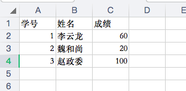
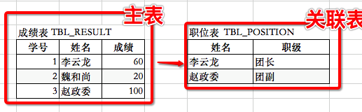

# SQL基础教程

## 数据库是什么

假设我们有一个成绩单

| 学号 | 姓名   | 成绩 |
| ---- | ------ | ---- |
| 1    | 李云龙 | 60   |
| 2    | 魏和尚 | 20   |
| 3    | 赵政委 | 100  |

如果想要用电脑存储可以考虑使用Excel 



但存在以下问题

- 无法处理大量数据 - 很难突破10w条 Excel大概只能处理6w条左右

- 不利于程序读写 - 需要特别的API

- 关联查询比较困难和统计困难

  

这个时候我们就考虑 需要数据库


数据库是一种专门管理数据的软件

- 可以处理大量数据
- 有统一的程序读写接口比如SQL
- 可以通过统一的语法处理关联查询和统计


## 数据库基础

目前我们最常用的数据库就是关系型数据库比如mysql oracle sqlserver。

### 表、字段、记录

二维表的形式来存储数据的


- 表的每一行称为记录（Record），记录是一个逻辑意义上的数据。
- 表的每一列称为字段（Column），同一个表的每一行记录都拥有相同的若干字段。每一行叫一条记录


### 数据类型

每个字段都需要定义数据类型

比如上表的数据类型

| 名称 | 类型  | 长度 |
| ---- | ----- | ---- |
| 学号 | INT   |      |
| 姓名 | VCHAR | 10   |
| 成绩 | INT   |      |

| 名称         | 类型           | 说明                                                         |
| :----------- | :------------- | :----------------------------------------------------------- |
| INT          | 整型           | 4字节整数类型，范围约+/-21亿                                 |
| BIGINT       | 长整型         | 8字节整数类型，范围约+/-922亿亿                              |
| REAL         | 浮点型         | 4字节浮点数，范围约+/-1038                                   |
| DOUBLE       | 浮点型         | 8字节浮点数，范围约+/-10308                                  |
| DECIMAL(M,N) | 高精度小数     | 由用户指定精度的小数，例如，DECIMAL(20,10)表示一共20位，其中小数10位，通常用于财务计算 |
| CHAR(N)      | 定长字符串     | 存储指定长度的字符串，例如，CHAR(100)总是存储100个字符的字符串 |
| VARCHAR(N)   | 变长字符串     | 存储可变长度的字符串，例如，VARCHAR(100)可以存储0~100个字符的字符串 |
| BOOLEAN      | 布尔类型       | 存储True或者False                                            |
| DATE         | 日期类型       | 存储日期，例如，2018-06-22                                   |
| TIME         | 时间类型       | 存储时间，例如，12:20:59                                     |
| DATETIME     | 日期和时间类型 | 存储日期+时间，例如，2018-06-22 12:20:59                     |

### 主键 - PrimaryKey

> 对于关系表，有个很重要的约束，就是任意两条记录不能重复。不能重复不是指两条记录不完全相同，而是指能够通过某个字段唯一区分出不同的记录，这个字段被称为*主键*。

- 自然主键 - 姓名和学号 基本不靠谱 （名字可以同名 其实学号也可以后补 鬼知道产品经理会如何反人类）

- 自增主键 - 数据库会在插入数据时自动为每一条记录分配一个自增整数，这样我们就完全不用担心主键重复，也不用自己预先生成主键；

- UUID - 局唯一GUID类型 

  使用一种全局唯一的字符串作为主键，类似`8f55d96b-8acc-4636-8cb8-76bf8abc2f57`。GUID算法通过网卡MAC地址、时间戳和随机数保证任意计算机在任意时间生成的字符串都是不同的，大部分编程语言都内置了GUID算法，可以自己预算出主键。

## MySQL

### 连接/退出

`mysql -h localhost -u root -P 3306 -p`
 **-h**：跟上数据库ip地址（localhost表示本机地址127.0.0.1）
 **-u**：mysql数据库登录名称。（root：表示超级管理员）
 **-P**：跟上数据库端口号（默认：3306，所以 **-P** 可以省略）
 **-p**：跟上mysql数据库密码（这里不推荐直接跟在 **-p** 后面，回车之后再书写）


```bash
# 连接
mysql -h localhost -u root -pexample 

# 退出
exit
```


### 创建 DataBase

```bash
CREATE DATABASE 数据库名称;
# eg:
CREATE DATABASE test;

# 创建并指定编码和排序规则
CREATE DATABASE `mydb` CHARACTER SET utf8 COLLATE utf8_general_ci;
```


### 选择数据库

```bash
use 数据库名称;
# eg:
use test;
```


### 删除数据库

```bash
DROP DATABASE <数据库名称>;
# eg:
DROP test;
```


## SQL

>  SQL是结构化查询语言的缩写，用来访问和操作数据库系统。

### 功能

| 数据定义 | 数据操作 | 数据查询 |
| -------- | -------- | -------- |
| 创建表   | 添加数据 | 条件筛选 |
| 删除表   | 修改数据 | 统计聚合 |
| 修改表   | 删除数据 | 关联查询 |

### 特点

- 接近英语语法

- 不同数据库间基本通用


### 数据定义 

> DDL：Data Definition Language

#### CREATE - 创建表

```sql
CREATE TABLE IF NOT EXISTS TBL_RESULT(
   id INT UNSIGNED AUTO_INCREMENT,
   name VARCHAR(100) NOT NULL,
   score INT UNSIGNED NOT NULL,
   PRIMARY KEY ( id )
);
```

结果验证

```bash
# 查询条
show tables;
========
mysql> show tables;
+----------------+
| Tables_in_user |
+----------------+
| TBL_RESULT     |
+----------------+
1 row in set (0.01 sec)

# desc TBL_RESULT;
=======
+-------+------------------+------+-----+---------+----------------+
| Field | Type             | Null | Key | Default | Extra          |
+-------+------------------+------+-----+---------+----------------+
| id    | int(10) unsigned | NO   | PRI | NULL    | auto_increment |
| name  | varchar(100)     | NO   |     | NULL    |                |
| score | int(10) unsigned | NO   |     | NULL    |                |
+-------+------------------+------+-----+---------+----------------+
3 rows in set (0.01 sec)
```

#### ALTER - 修改表结构

```bash
# 常用的语法格式如下：
ALTER TABLE <表名> [修改选项]
# 修改选项的语法格式如下：
{ ADD COLUMN <列名> <类型>
| CHANGE COLUMN <旧列名> <新列名> <新列类型>
| ALTER COLUMN <列名> { SET DEFAULT <默认值> | DROP DEFAULT }
| MODIFY COLUMN <列名> <类型>
| DROP COLUMN <列名>
| RENAME TO <新表名> }

```

```sql
ALTER TABLE TBL_RESULT
MODIFY COLUMN score INT(20) unsigned;
```

结果验证

```bash
mysql> desc TBL_RESULT;
+-------+------------------+------+-----+---------+----------------+
| Field | Type             | Null | Key | Default | Extra          |
+-------+------------------+------+-----+---------+----------------+
| id    | int(10) unsigned | NO   | PRI | NULL    | auto_increment |
| name  | varchar(100)     | NO   |     | NULL    |                |
| score | int(20) unsigned | YES  |     | NULL    |                |
+-------+------------------+------+-----+---------+----------------+
3 rows in set (0.01 sec)
```

#### DROP - 删除表结构

```sql
DROP TABLE TBL_RESULT;
```

结果验证

```bash
show tables;
========
mysql> show tables;
Empty set (0.00 sec)
```

### 数据操作 

> DML：Data Manipulation Language

#### INSERT

```bash
INSERT INTO TBL_RESULT (name,score) VALUES ('tom',20);
```

#### UPDATE

```
UPDATE TBL_RESULT SET score=80 WHERE name = 'tom';
```

#### DELETE

```
DELETE FROM TBL_RESULT WHERE name = 'tom';
```

#### TRUNCATE

```bash
TRUNCATE TABLE TBL_RESULT;
```

### 数据查询

> DQL：Data Query Language

```
INSERT INTO TBL_RESULT (name,score) VALUES ('李云龙',20);
INSERT INTO TBL_RESULT (name,score) VALUES ('魏和尚',80);
INSERT INTO TBL_RESULT (name,score) VALUES ('赵政委',100);
```

#### 条件查询

```mysql
SELECT name ,score 
FROM TBL_RESULT
WHERE score > 60
ORDER BY score DESC;
```

#### 分组、聚合查询

```
# 平均分
SELECT name ,AVG(score),SUM(score)
FROM TBL_RESULT
GROUP BY name;
```

#### 连接查询

成绩表 TBL_RESULT

| 学号 | 姓名   | 成绩 |
| ---- | ------ | ---- |
| 1    | 李云龙 | 60   |
| 2    | 魏和尚 | 20   |
| 3    | 赵政委 | 100  |

职位表  TBL_POSITION

| 姓名   | 职级   |
| ------ | ------ |
| 李云龙 | 团长   |
| 赵政委 | 团副   |

数据准备

```js
DROP TABLE TBL_POSITION;
CREATE TABLE IF NOT EXISTS TBL_POSITION(
   name VARCHAR(100) NOT NULL,
   position VARCHAR(100)  NOT NULL,
   PRIMARY KEY ( name )
);
INSERT INTO TBL_POSITION (name,position) VALUES ('李云龙','团级');
INSERT INTO TBL_POSITION (name,position) VALUES ('赵政委','团副');
```



```mysql
SELECT a.name,a.score,b.position
FROM TBL_RESULT a
LEFT JOIN TBL_POSITION b
ON a.name = b.name;
```

结果

```bash
+-----------+-------+----------+
| name      | score | position |
+-----------+-------+----------+
| 李云龙    |    20 | 团级     |
| 赵政委    |   100 | 团副     |
| 魏和尚    |    80 | NULL     |
+-----------+-------+----------+
3 rows in set (0.00 sec)
```


### 进阶操作

<待>

