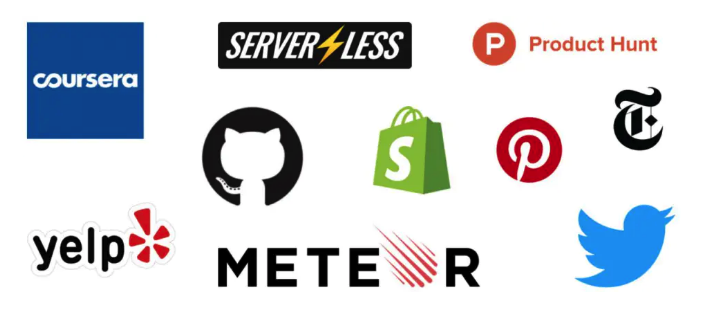
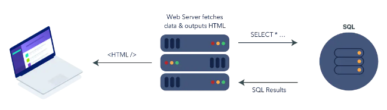
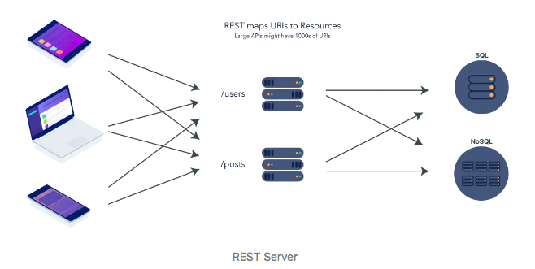

# Rest的替代品来了,它叫 GraphQL



你知道吗？FaceBook、GitHub，Pinterest，Twitter，Sky，纽约时报，Shopify，Yelp这些大公司已经在使用GraphQL规范的接口规范了。再不学习就落后了。

## 你将Get到的技能

- GraphQL概念
- 实战GraphQL - Query/Mutation/Subscription
- Rest vs GraphQL 对比分析
- 如何搭建GraphQL后端服务
- 如何利用React hooks 、Provider封装GraphQL客户端
- 如何通过GraphQL完成对数据变化的订阅


## GraphQL优势

## 前端的四个时代和接口风格的变迁


按照[阮一峰老师的全栈历史](https://github.com/ruanyf/jstraining/blob/master/docs/history.md)我们可以把前端的历史划分为四个时代。

- 后端渲染时代

  

- 前后端分离时代

  


## GraphQL

### 概念
- GraphQL 是由 Facebook 创造的用于 API 的查询语言。

- 前后端数据查询方式的规范。

GraphQL 既是一种用于 API 的查询语言也是一个满足你数据查询的运行时。 GraphQL 对你的 API 中的数据提供了一套易于理解的完整描述，使得客户端能够准确地获得它需要的数据，而且没有任何冗余，也让 API 更容易地随着时间推移而演进，还能用于构建强大的开发者工具。


### 优势

- 更大的灵活性
- 精确定义所需数据的能力（GraphQL拥有强类型）
- 仅仅会返回你需要的数据（避免数据冗余）
- GraphQL允许您通过一次调用替换多个REST请求以获取指定的数据


Github GraphQL Explorer

https://developer.github.com/v4/explorer/


/apollo-server/index.js

```
// apollo-server/index.js
nodemon index.js
```


```json
# GraphQL
query hellobook{
	books {
    title
  },
  hello,
  book2: books {
    abc:title
    bcd:author
  },
}

## Result
{
  "data": {
    "books": [
      {
        "title": "abc"
      }
    ],
    "hello": "Hello world!",
    "book2": [
      {
        "abc": "abc",
        "bcd": "xxxx"
      }
    ]
  }
}
```


### 语法解释

#### Query

##### 列表

```
query {
	books {
    title,
    author
  }
}

### Result
{
  "data": {
    "books": [
      {
        "title": "abc",
        "author": "xxxx"
      }
    ]
  }
}
```

##### 条件查询

```json
query {
	book(id:"123") {
    title,
    author
  }
}

### Result
```


#### Mutation

```json
mutation {
	createBook(title:"TTTT",author: "AAA") {
    id
  },
}
```

##### 查询参数


#### Subscription

```bash
subscription  {
	subsBook(id:1) {
    id,
    title
  },
}

```


```bash
subscription {
  subsBooks{
    id
  }
}
```


## Apollo

目前对GraphQL最流行的实现方案就是Apollo。


### 概念

Apollo 是基于 GraphQL 的全栈解决方案集合。包括了 apollo-client 和 apollo-server ；从后端到前端提供了对应的 lib 使得开发使用 GraphQL 更加的方便。


