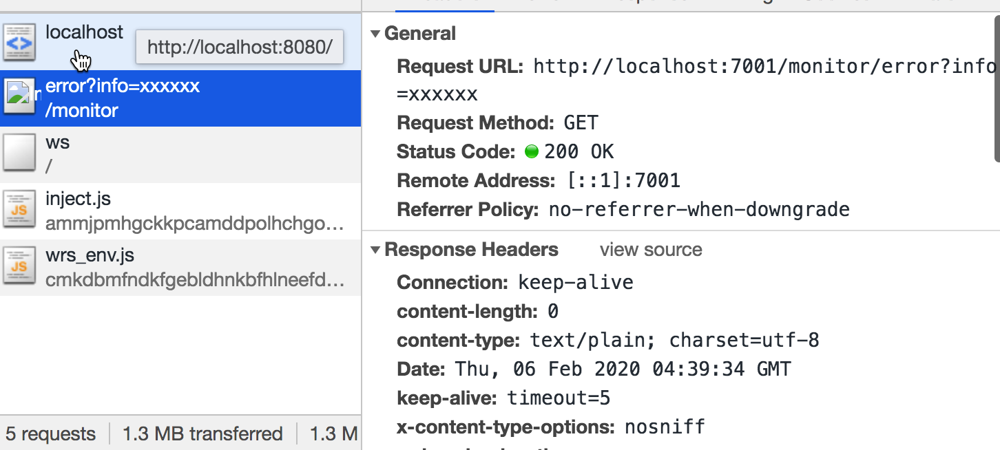
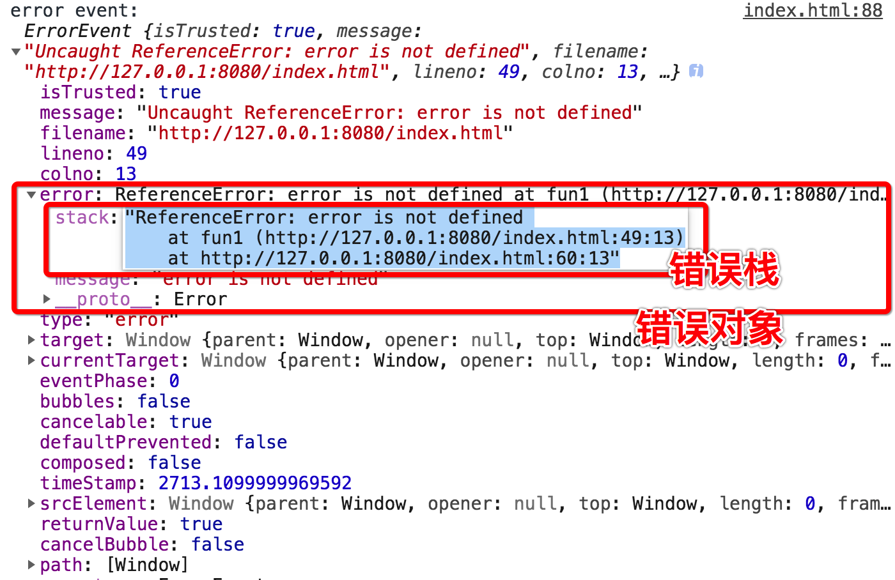
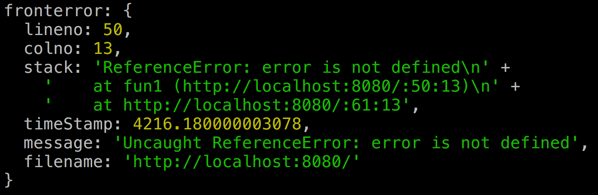
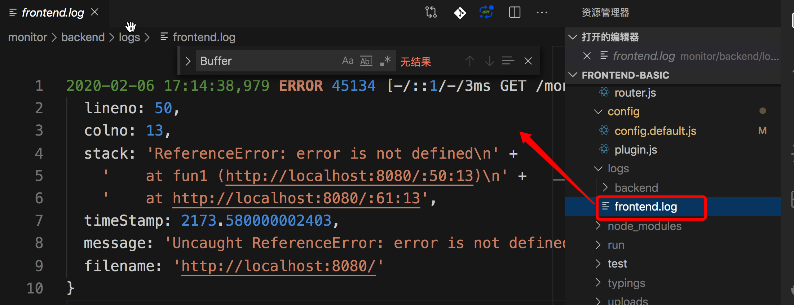

# 前端异常监控系统

## 您将Get的技能

- 收集前端错误（原生、React、Vue）
- 错误上报至后端服务器
- 解析错误堆栈
- 利用webpack插件自动上传sourcemap
- docker部署


## 工作流程

1. 收集错误
2. 上报错误
3. 代码上线打包将sourcemap文件上传至错误监控服务器
4. 发生错误时监控服务器接收错误并记录到日志中
5. 根据sourcemap和错误日志内容进行错误分析


## 异常收集

### JS异常

js异常的特点是,出现不会导致JS引擎崩溃 最多只会终止当前执行的任务。比如一个页面有两个按钮，如果点击按钮发生异常页面，这个时候页面不会崩溃，只是这个按钮的功能失效，其他按钮还会有效。


```js
setTimeout(() => {
  console.log('1->begin')
  error
  console.log('1->end')
})
setTimeout(() => {
  console.log('2->begin')
  console.log('2->end')
})
```


上面的例子我们用setTimeout分别启动了两个任务，虽然第一个任务执行了一个错误的方法。程序执行停止了。但是另外一个任务并没有收到影响。


其实如果你不打开控制台都看不到发生了错误。好像是错误是在静默中发生的。

下面我们来看看这样的错误该如何收集。

#### try-catch

JS作为一门高级语言我们首先想到的使用try-catch来收集。

```js
setTimeout(() => {
  try {
    console.log('1->begin')
    error
    console.log('1->end')
  } catch (e) {
    console.log('catch',e)
  }
})
```


如果在函数中错误没有被捕获，错误会上抛。

```js
function fun1() {
  console.log('1->begin')
  error
  console.log('1->end')
}
setTimeout(() => {
  try {
    fun1()
  } catch (e) {
    console.log('catch',e)
  }
})
```

控制台中打印出的分别是错误信息和错误堆栈。


读到这里大家可能会想那就在最底层做一个错误try-catch不就好了吗。确实作为一个从java转过来的程序员也是这么想的。但是理想很丰满，现实很骨感。我们看看下一个例子。

```js
function fun1() {
  console.log('1->begin')
  error
  console.log('1->end')
}

try {
  setTimeout(() => {
    fun1()

  })
} catch (e) {
  console.log('catch', e)
}
```


大家注意运行结果，异常并没有被捕获。

这是因为JS的try-catch功能非常有限一遇到异步就不好用了。那总不能为了收集错误给所有的异步都加一个try-catch吧，太坑爹了。其实你想想异步任务其实也不是由代码形式上的上层调用的就比如本例中的settimeout。大家想想eventloop就明白啦，其实这些一步函数都是就好比一群没娘的孩子出了错误找不到家大人。当然我也想过一些黑魔法来处理这个问题比如代理执行或者用过的异步方法。算了还是还是再看看吧。


#### window.onerror

window.onerror 最大的好处就是可以同步任务还是异步任务都可捕获。

```js
function fun1() {
  console.log('1->begin')
  error
  console.log('1->end')
}
window.onerror = (...args) => {
  console.log('onerror:',args)
}

setTimeout(() => {
  fun1()
})
```


- onerror返回值

  onerror还有一个问题大家要注意 如果返回返回true 就不会被上抛了。不然控制台中还会看到错误日志。


#### 监听error事件 

> window.addEventListener('error',() => {}）

其实onerror固然好但是还是有一类异常无法捕获。这就是网络异常的错误。比如下面的例子。

```html

```

试想一下我们如果页面上要显示的图片突然不显示了，而我们浑然不知那就是麻烦了。

addEventListener就是

```js
window.addEventListener('error', args => {
  console.log(
    'error event:', args
  );
  return true;
}, true);
```

运行结果如下：


#### Promise异常捕获

Promise的出现主要是为了让我们解决回调地域问题。基本是我们程序开发的标配了。虽然我们提倡使用es7 async/await语法来写，但是不排除很多祖传代码还是存在Promise写法。

```js
new Promise((resolve, reject) => {
  abcxxx()
});
```

这种情况无论是onerror还是监听错误事件都是无法捕获的

```js
new Promise((resolve, reject) => {
  error()
})
// 增加异常捕获
  .catch((err) => {
  console.log('promise catch:',err)
});
```

除非每个Promise都添加一个catch方法。但是显然是不能这样做。

```js
window.addEventListener("unhandledrejection", e => {
  console.log('unhandledrejection',e)
});
```


我们可以考虑将unhandledrejection事件捕获错误抛出交由错误事件统一处理就可以了

```js
window.addEventListener("unhandledrejection", e => {
  throw e.reason
});
```


#### async/await异常捕获

```js
setTimeout(async() => {
  try {
    await asyncFun()
  } catch (e) {
    console.log('catch:',e)
  }
})
```

实际上async/await语法本质还是Promise语法。区别就是async方法可以被上层的try/catch捕获。


如果不去捕获的话就会和Promise一样，需要用unhandledrejection事件捕获。这样的话我们只需要在全局增加unhandlerejection就好了。


#### 小结

| 异常类型                   | 同步方法 | 异步方法 | 资源加载 | Promise | async/await |
| -------------------------- | -------- | -------- | -------- | ------- | ----------- |
| try/catch                  | ✔️        |          |          |         | ✔️           |
| onerror                    | ✔️        | ✔️        |          |         |             |
| error事件监听              | ✔️        | ✔️        | ✔️        |         |             |
| unhandledrejection事件监听 |          |          |          | ✔️       | ✔️           |

实际上我们可以将unhandledrejection事件抛出的异常再次抛出就可以统一通过error事件进行处理了。

最终用代码表示如下：

```js
window.addEventListener("unhandledrejection", e => {
  throw e.reason
});
window.addEventListener('error', args => {
  console.log(
    'error event:', args
  );
  return true;
}, true);
```

### webpack工程化

### Vue

#### handleError

(待...)

### React

#### componentDidCatch

#### ErrorBoundary标签

(待...)

### 跨域代码异常

(待...)

### IFrame异常

(待...)


## 异常上报

### 选择通讯方式

#### 动态创建img标签

其实上报就是要将捕获的异常信息发送到后端。最常用的方式首推动态创建标签方式。因为这种方式无需加载任何通讯库，而且页面是无需刷新的。基本上目前包括百度统计 Google统计都是基于这个原理做的埋点。

```js
new Image().src = 'http://localhost:7001/monitor/error'+ '?info=xxxxxx'
```



通过动态创建一个img,浏览器就会向服务器发送get请求。可以把你需要上报的错误数据放在querystring字符串中，利用这种方式就可以将错误上报到服务器了。

#### Ajax上报

这个太基础了而且不常用，如果实际上用axios库就可以搞定。


### 上报哪些数据



我们先看一下error事件参数：


| 属性名称 | 含义          | 类型   |
| -------- | ------------- | ------ |
| message  | 错误信息      | string |
| filename | 异常的资源url | string |
| lineno   | 异常行号      | int    |
| colno    | 异常列号      | int    |
| error    | 错误对象      | object |
| error.message    | 错误信息      |  string |
| error.stack    | 错误信息      |  string      |


其中核心的应该是错误栈，其实我们定位错误最主要的就是错误栈。

错误堆栈中包含了绝大多数调试有关的信息。其中包括了异常位置（行号，列号），异常信息

有兴趣的同学可以看看这篇文章

>https://github.com/dwqs/blog/issues/49


### 上报数据序列化

由于通讯的时候只能以字符串方式传输，我们需要将对象进行序列化处理。

大概分成以下三步：

- 将异常数据从属性中解构出来存入一个JSON对象

- 将JSON对象转换为字符串

- 将字符串转换为Base64

当然在后端也要做对应的反向操作 这个我们后面再说。

```js

window.addEventListener('error', args => {
  console.log(
    'error event:', args
  );
  uploadError(args)
  return true;
}, true);
function uploadError({
    lineno,
    colno,
    error: {
      stack
    },
    timeStamp,
    message,
    filename
  }) {
    // 过滤
    const info = {
      lineno,
      colno,
      stack,
      timeStamp,
      message,
      filename
    }
    // const str = new Buffer(JSON.stringify(info)).toString("base64");
  	const str = window.btoa(JSON.stringify(info))
    const host = 'http://localhost:7001/monitor/error'
    new Image().src = `${host}?info=${str}`
}
```


## 异常收集

异常上报的数据一定是要有一个后端服务接收才可以。

我们就以比较流行的开源框架eggjs为例来演示

### 搭建eggjs工程

```js
# 全局安装egg-cli
npm i egg-init -g 
# 创建后端项目
egg-init backend --type=simple
cd backend
npm i
# 启动项目
npm run dev
```

### 编写error上传接口

首先在app/router.js添加一个新的路由

```js
module.exports = app => {
  const { router, controller } = app;
  router.get('/', controller.home.index);
  // 创建一个新的路由
  router.get('/monitor/error', controller.monitor.index);
};
```

创建一个新的controller (app/controller/monitor)

```js
'use strict';

const Controller = require('egg').Controller;
const { getOriginSource } = require('../utils/sourcemap')
const fs = require('fs')
const path = require('path')

class MonitorController extends Controller {
  async index() {
    const { ctx } = this;
    const { info } = ctx.query
    const json = JSON.parse(Buffer.from(info, 'base64').toString('utf-8'))
    console.log('fronterror:', json)
    ctx.body = '';
  }
}

module.exports = MonitorController;

```



看一下接收后的结果


### 记入日志文件

下一步就是讲错误记入日志。实现的方法可以自己用fs写，也可以借助log4js这样成熟的日志库。

当然在eggjs中是支持我们定制日志那么我么你就用这个功能定制一个前端错误日志好了。

在/config/config.default.js中增加一个定制日志配置

```js
// 定义前端错误日志
config.customLogger = {
  frontendLogger : {
    file: path.join(appInfo.root, 'logs/frontend.log')
  }
}
```

在/app/controller/monitor.js中添加日志记录

```js
async index() {
    const { ctx } = this;
    const { info } = ctx.query
    const json = JSON.parse(Buffer.from(info, 'base64').toString('utf-8'))
    console.log('fronterror:', json)
    // 记入错误日志
    this.ctx.getLogger('frontendLogger').error(json)
    ctx.body = '';
  }
```

最后实现的效果




## 异常分析

### Webpack插件实现SourceMap上传

### 解析ErrorStack

### 还原代码