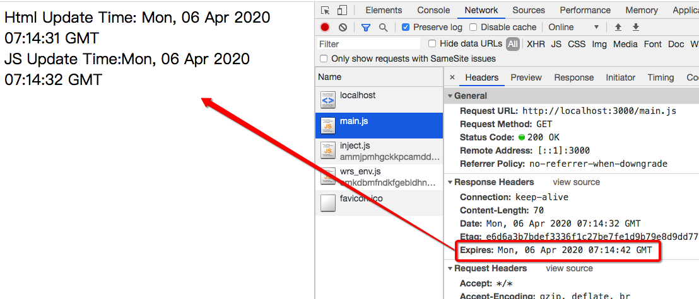
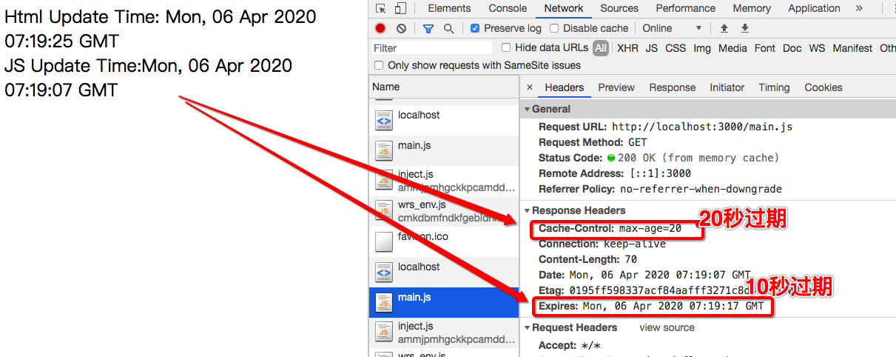
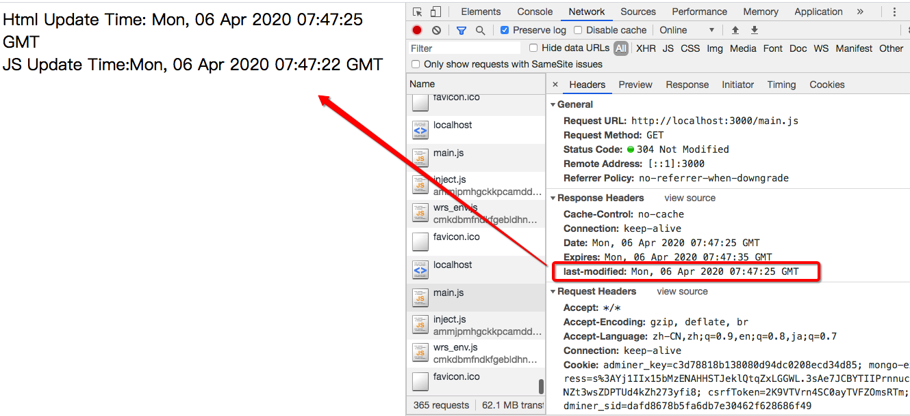
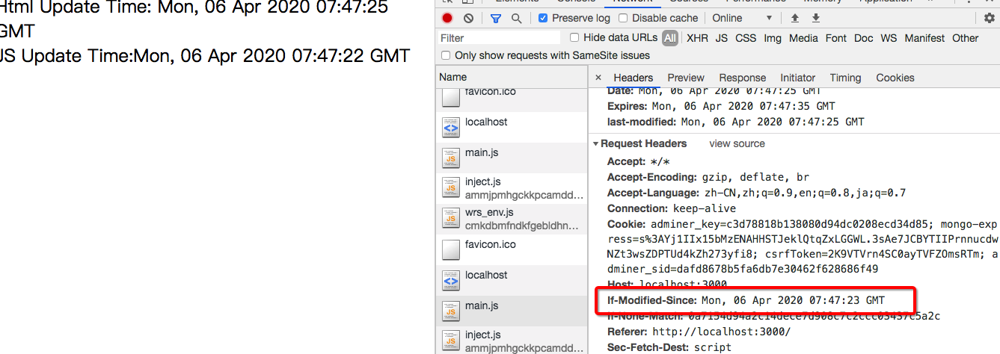
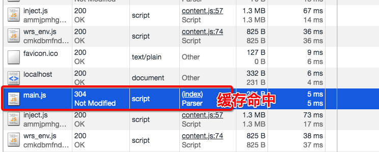
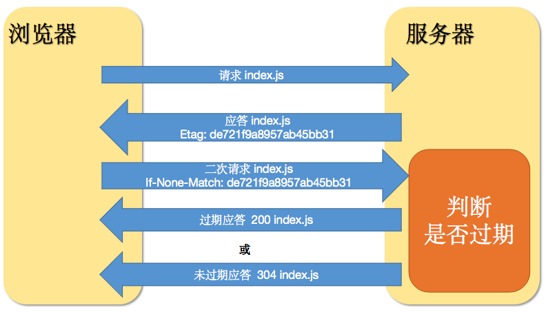
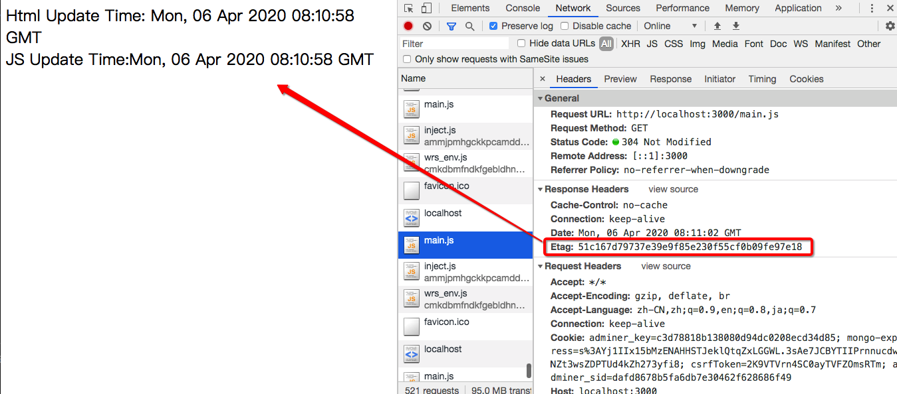
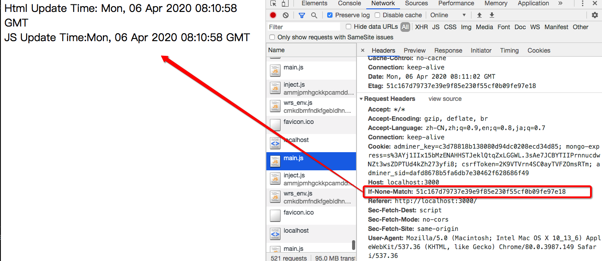
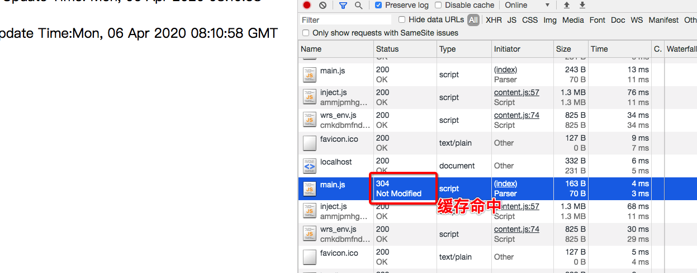
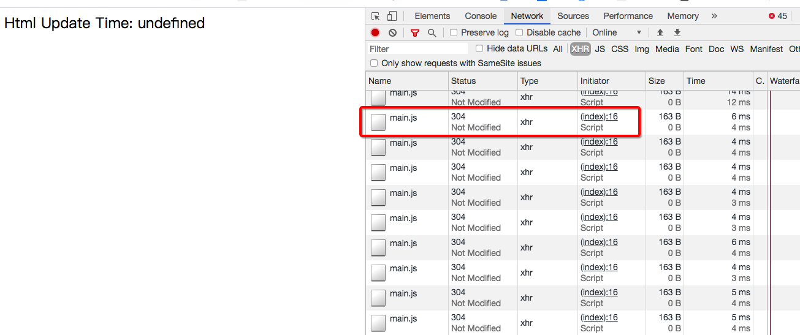

# HTTP缓存机制-NodeJS一步一步试验

## Web缓存是什么

### 动机

当浏览器加载一个页面时html引用的外部资源也会加载。但这些外部资源比如图片、css、js都不经常变化。如果每次都加在这些资源势必会带来资源的浪费。而且加载时间过长也会影响用户体验。

HTTP缓存技术就是为了解决这个问题出现的。简单的讲HTTP缓存就是将静态资源存储在浏览器内部，下次请求相同资源时可以直接使用。

当然何时使用何时不使用要有一些系列的策略保证如果资源一旦更新，缓存也要随之而更新。


### 作用

- 提高首屏加载速度 -> 优化用户体验
- 减少流量消耗 
- 减轻服务器压力


## 强缓存策略

直接从本地副本比对读取，**不去请求服务器**，返回的状态码是 **200**。

这里面就有一个问题如果不去服务器请求如果静态资源更新了而浏览器还在使用新的静态资源怎么办呢？答案是使用定时器的方式也就是强缓存可以设置静态资源的有效期。如果超过有效期就认为缓存作废。


### HTTP 1.0

#### expires

`expires` 是 `HTTP1.0` 中定义的缓存字段。当我们请求一个资源，服务器返回时，可以在 `Response Headers` 中增加 `expires` 字段表示资源的过期时间。

```http
expires: Thu, 03 Jan 2019 11:43:04 GMT
```

它是一个**时间戳**（准确点应该叫格林尼治时间），当客户端再次请求该资源的时候，会把客户端时间与该时间戳进行对比，如果大于该时间戳则已过期，否则直接使用该缓存资源。

但是，有个大问题，发送请求时是使用的**客户端时间**去对比。一是客户端和服务端时间可能快慢不一致，另一方面是客户端的时间是可以自行修改的（比如浏览器是跟随系统时间的，修改系统时间会影响到），所以不一定满足预期。

##### 实例验证

###### 随时间变化的内容

我们用一个函数来完成 其中设置定时器每隔一段时间更新一下时间

```js
function updateTime() {
    setInterval(() => this.time = new Date().toUTCString(), 1000)
    return this.time
}
```

###### Web服务

访问根目录时会返回一个HTML页面里面会输出时间。其中加载一个js作为静态资源，而js的功能是打印一个字符串字符串的内容是不断变化的时间。这样的话如果js使用的是缓存，JS的时间较旧，HTML中的时间和JS产生的时间一定会不一致。

```js
const http = require('http')
http.createServer((req, res) => {
    console.log('url:', `${req.method} ${req.url} `)

    const { url } = req
    if ('/' === url) {
        res.end(`
            <html>
                <!-- <meta http-equiv="Refresh" content="5" /> -->
                Html Update Time: ${updateTime()}
                <script src='main.js'></script>
            </html>
            `)
    } else if (url === '/main.js') {
        const content = `document.writeln('<br>JS   Update Time:${updateTime()}')`
       
        res.statusCode = 200
        res.end(content)
    } else if (url === '/favicon.ico') {
        console.log('favicon..')
        res.end('')
    }
})
    .listen(3000, () => {
        console.log('Http Cache Test at:' + 3000)
    })
```


###### expires缓存试验

```js
// 强缓存
res.setHeader('Expires', new Date(Date.now() + 10 * 1000).toUTCString())
```




#### 


### HTTP 1.1

#### cache-control

正由于上面说的可能存在的问题，`HTTP1.1` 新增了 `cache-control` 字段来解决该问题，所以当 `cache-control` 和 `expires` 都存在时，`cache-control` 优先级更高。该字段是一个时间长度，单位秒，表示该资源过了多少秒后失效。当客户端请求资源的时候，发现该资源还在有效时间内则使用该缓存，它**不依赖客户端时间**。`cache-control` 主要有 `max-age` 和 `s-maxage`、`public` 和 `private`、`no-cache` 和 `no-store` 等值。

| Cache-directive                      | 说明                                                         |
| :----------------------------------- | :----------------------------------------------------------- |
| public                               | 所有内容都将被缓存 （客户端和代理服务器都可以缓存）          |
| private                              | 内容只缓存到私有缓存中（客户端可以缓存）                     |
| no-cache                             | 需要使用协商缓存来验证缓存数据                               |
| no-store                             | 所有内容都不会缓存                                           |
| must-revalidation/proxy-revalidation | 如果缓存的内容失效，请求必须发送到服务器/代理以进行重新验证  |
| max-age=xxx (xxx is numeric)         | 缓存的内容将在 xxx 秒后失效, 这个选项只在HTTP 1.1可用, 并如果和Last-Modified一起使用时, 优先级较高 |

增加cache缓存控制设定20秒后过期。注意这个时候有两个规则我们也可以趁机测试一下优先顺序。

```js
res.setHeader('Cache-Control', 'max-age=20')
```



我们在10秒后刷新依然在读缓存说明缓存生效而且是以Cache-Control优先的。

## 协商缓存

上面的 `expires` 和 `cache-control` 都会**访问本地缓存直接验证**看是否过期，如果没过期直接使用本地缓存，并返回 200。但如果设置了 `no-cache` 和 `no-store` 则本地缓存会被忽略，会去**请求服务器验证**资源是否更新，如果没更新才继续使用本地缓存，此时返回的是 304，这就是协商缓存。协商缓存主要包括 `last-modified` 和 `etag`。

协商缓存简单的说就是浏览器和服务器间就是否要使用缓存在做协商。如果协商的结果是需要更新就会返回200并返回更新内容。如果不需要只需要返回状态码304不用返回内容这样虽然需要后端应答但是后端既不需要生成内容也不需要传输内容。依然可以享受缓存的种种好处。

### last-modified & if-Modified-Since

这是一组通过协商修改时间为基础的策略。


- 静态资源应答时都会通过last-modified来标示修改时间。
- 浏览器下次请求相同资源会将last-modified时间作为if-modified-since字段放在请求报文中用以询问服务器是否该资源过期。
- 服务器需要通过规则判断是否过期
- 过期时直接返回200并在body中放入更新内容
- 如果未过期则直接返回304状态码即可

```js
res.setHeader('Cache-Control', 'no-cache')
        res.setHeader('last-modified', new Date().toUTCString())
        if (new Date(req.headers['if-modified-since']).getTime() + 3 * 1000 > Date.now()) {
            console.log('协商缓存命中....')
            res.statusCode = 304
            res.end()
            return
        }
```








### etag & if-None-Match

另一种办法应该是通过内容判断，一般的做法是将返回内容进行摘要（Hash），然后通过对比摘要来判断内容是否更新。



- 静态资源应答时都会通过etag来标示内容摘要。
- 浏览器下次请求相同资源会将etag时间作为if-none-match字段放在请求报文中用以询问服务器是否该资源过期。
- 服务器需要通过和服务器内容的摘要进行比对确定是否过期
- 过期时直接返回200并在body中放入更新内容
- 如果未过期则直接返回304状态码即可

测试一下

```js
res.setHeader('Cache-Control', 'no-cache')
const crypto = require('crypto');
const hash = crypto.createHash('sha1').update(content).digest('hex')
res.setHeader('Etag', hash)
if(req.headers['if-none-match'] === hash){
  console.log('Etag协商缓存命中.....')
  res.statusCode = 304
  res.end()
  return 
}
```









## AJAX缓存

下面我们总结一下Ajax的缓存问题。Ajax通常会分为Get、Post、Put、Delete等情况。其中Get操作通常会用作哪些不会改变的服务状态的操作。或者叫等幂操作。缓存机制依然会沿用HTTP缓存的处理方式。

```js
<script>
                    let xhr = new XMLHttpRequest()
                    xhr.onreadystatechange = () => {
                        if (xhr.readyState==4){
                            console.log('request ' + xhr.status + ' ' +xhr.responseText)                 
                        }
                    }
                    
                    setInterval(() => {
                        xhr.open('GET', '/main.js', true);
                        xhr.send()
                    },1000)

                </script>
```



## ServiceWorker

service worker是一个在==浏览器后台==运行的脚本。无论网络连接如何，能够使用Web应用程序意味着用户可以在飞机，地铁或连接受限或不可用的地方不间断地操作。 该技术将有助于提高客户端的工作效率，并将提高应用程序的可用性。

通过service worker，我们可以预先缓存网站的某些资源。 我们作为资源引用的是JavaScript文件，CSS文件，图像和一些字体。 这将有助于我们加快加载时间，而不必每次访问同一网站时都必须从服务器获取。 当然，最重要的是，当我们网络不畅时，这些资源将可供我们使用。

这个研究我们后续会放出敬请期待。

chrome://serviceworker-internals/ 

