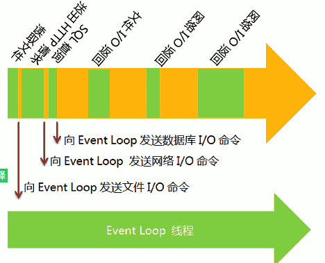
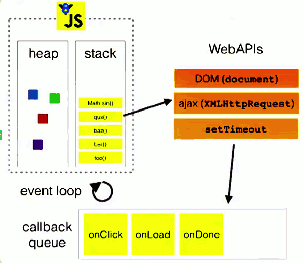

# 事件循环_EventLoop

## 为什么需要事件循环

### 从计算机原理说起

事件循环出现的原因我们还是要从计算机的机制说起。或者是说计算机制带来的一堆基本矛盾说起。什么基本矛盾呢。计算机中内存和cpu处理速度飞快每个任务几乎都可以在1ms内接解决。而I/O读写无论是网络还是磁盘相较于前者都会慢上百倍。有点像上课，一个班里学生总是会参差不齐。好学生(CPU、内存)当堂就可以完成作业，差学生（I/O、交互）需要回家才能完成甚至有那些不交作业的。如果老师每次都等着所有人都提交再讲下一章内容。显然好学生的时间都被浪费掉了。

为了解决这个问题，聪明的程序员想了很多办法。

### 并行编程之难

最简单的办法就是并行处理。开启多个进程或者多个线程对程序进行处理。这种方法虽然看起来很有效，但是却给程序的编写带来的巨大困难。别忘了代码还是一片文章。本身就是线性结构。写作之难在于把网站的思考和树状的结构在线性展开的语句中。想一想 如果你面试java工程师，上来就会问到你多线程的问题，考察高级后端工程师并发处理就是最好的试金石。

### 为什么前端躲不掉

问题回到前端回到JS语言，JS语言诞生是单线程的，原因是不想让浏览器变得特别复杂。也不想让一门脚本语言太过复杂。当然这里面要把新技术servicework排除出去。但是前端要做的事情要和人进行交互和后台进行通讯的这些IO问题。一方面要简单一方面又要频繁处理IO而且还要高效不能浪费系统资源出现卡顿。事件循环机制就此诞生。

### 事件循环是什么

事件循环就好比给班里加了个辅导员，老师留作业的时候还是要求好学生当堂完成，而差学生要求回家做作业交给辅导员批改后提交老师。这样教学进度推进起来就顺利了。这个辅导员就是事件循环线程。

我们下面看看定义

事件循环就是为了解决这个问题而诞生的。

> "**Event Loop是一个程序结构，用于等待和发送消息和事件。**（a programming construct that waits for and dispatches events or messages in a program.）

简单地说 就是程序设置两个线程：一份负责主程序运行，称为做主线程。

另一个负责主线程与其他线程通讯（主要是交互和IO处理）称为EventLoop。



所谓回家写作业这个就叫做回调函数。

当堂完成就叫做同步任务。

课后找辅导员叫异步模式（asynchronous I/O），带来的好处是差生不会影响教学进度叫 "非堵塞模式"（non-blocking mode）。


## 浏览器中的事件循环

在浏览器内核中主要有五个线程

### 浏览器内核线程

1、GUI渲染线程

- 负责解析HTML、CSS -> 构建DOM树、CSSOM、Render树 -> layout布局 -> 绘制
- 当js操作DOM等原因导致界面发生Repaint或Reflow时，都会触发GUI线程执行
- GUI渲染线程与JS引擎线程是互斥的，当JS引擎线程执行时，GUI渲染引擎会被挂起保存到一个队列里，当JS引擎线程空闲时，再开始执行

2、JavaScript引擎线程

- 又称为js内核，常用的是Google的V8引擎、火狐的JaegerMonkey引擎等
- 解析JavaScript脚本，执行程序
- 一个渲染引擎中只包含一个js引擎线程，同时JavaScript语言也是单线程模式，因为如果JavaScript是多线程的方式来操作这些UI DOM，则可能出现UI操作的冲突，这也就是为什么Web Worker API支持在主线程的基础上多开一个线程处理js逻辑，但不允许操作DOM的原因，并且有诸多限制，感兴趣的可以了解一下
- js代码作为一个个任务，由任务队列统一调度分配，JS引擎一直等待任务队列中任务到来，有任务过来时，JS引擎线程便开始执行
- 因为JavaScript引擎线程会导致GUI渲染线程挂起的原因，常常会出现js阻塞页面渲染的现象，这是我们应该尽量避免的

3、事件触发线程

- 我们经常会用到的点击事件等
- 当js引擎线程执行代码到点击事件时，浏览器会将该事件任务添加到事件触发线程中并开始监听点击事件，当对应的事件满足条件被触发时，该线程就把触发事件后的回调任务添加到task queue队列中，排队等待JS引擎线程来执行回调函数

4、定时触发器线程

- setTimeOut\setTimeInterval
- 当JS引擎线程执行到setTimeOut\setTimeInterval 关键词时，会把定时器任务添加到定时触发器线程中，定时触发器线程开始执行倒数，当倒数之间到了后，将回调任务添加到task queue任务队列中，等待JS引擎线程来执行

5、异步请求线程

- 当发送异步ajax请求时，浏览器会开启异步请求线程进行http请求
- 当检测到请求状态发生变更后，将回调函数添加到task queue任务队列中，等待JS引擎线程来执行


### 同步代码的执行

如果是同步代码通常只需要JS引擎线程即可以完成。工作流程如下：

```js
function main() {
   add()
}
function add() {
   const a = 1 + 2
}
```


JS代码解释器会把同步函数放入调用栈中，并按照先入后出原则进行执行。


### 异步宏任务(Job)

当遇到定时器(setTimeout 或 setInterval)、Dom事件、异步请求(xmlHttpRequest)时由于属于异步处理需要交给对应的线程进行处理。待处理完成后将对应的线程会把处理结果放入任务处理队列。等主线程完成同步任务后再对处理队列中的任务。这就好比差生的作业完成后放在一个队列里面，主讲老师讲完课再进行批改而不是可课上直接批改，如果你完成的相对较慢可能会在很多次课之后才会提交，无论何时提交老师下课后都会批改完作业队列中的作业。

```js
function main() {
    setOnload()
}


function setOnload() {
    window.onload = function () {
        console.log('onload ...')
    }
}
```


为了更好地理解Event Loop，请看下图（转引自Philip Roberts的演讲《Help, I'm stuck in an event-loop》）。



上图中，主线程运行的时候，产生堆（heap）和栈（stack），栈中的代码调用各种外部API，它们在"任务队列"中加入各种事件（click，load，done）。只要栈中的代码执行完毕，主线程就会去读取"任务队列"，依次执行那些事件所对应的回调函数。


执行栈中的代码（同步任务），总是在读取"任务队列"（异步任务）之前执行。请看下面这个例子。

> ```javascript
>     var req = new XMLHttpRequest();
>     req.open('GET', url);    
>     req.onload = function (){};    
>     req.onerror = function (){};    
>     req.send();
> ```

上面代码中的req.send方法是Ajax操作向服务器发送数据，它是一个异步任务，意味着只有当前脚本的所有代码执行完，系统才会去读取"任务队列"。所以，它与下面的写法等价。

> ```javascript
>     var req = new XMLHttpRequest();
>     req.open('GET', url);
>     req.send();
>     req.onload = function (){};    
>     req.onerror = function (){};   
> ```

也就是说，指定回调函数的部分（onload和onerror），在send()方法的前面或后面无关紧要，因为它们属于执行栈的一部分，系统总是执行完它们，才会去读取"任务队列"。


我们看看如何立即这个概念。


### Js中的堆和栈

堆和栈都是运行时内存中分配的一个数据区，因此也被称为堆区和栈区；

二者存储的数据类型和处理速度不同；

**堆**（heap）用于复杂数据类型（**引用类型**）分配空间，例如数组对象、object对象；它是运行时动态分配内存的，因此存取速度较慢。

**栈**（stack）中主要存放一些**基本类型的变量和对象的引用**，(包含**池，****池存放常量**),其优势是存取速度比堆要快，并且栈内的数据可以共享，但缺点是存在栈中的数据大小与生存期必须是确定的，缺乏灵活性，

先进后出原则


