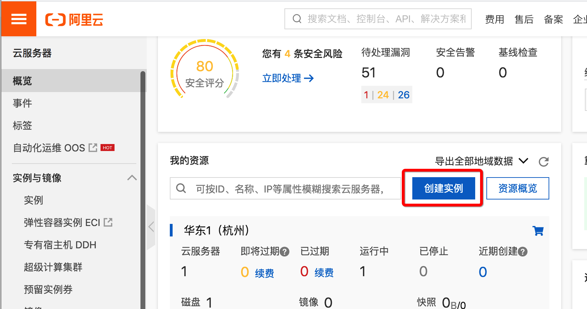
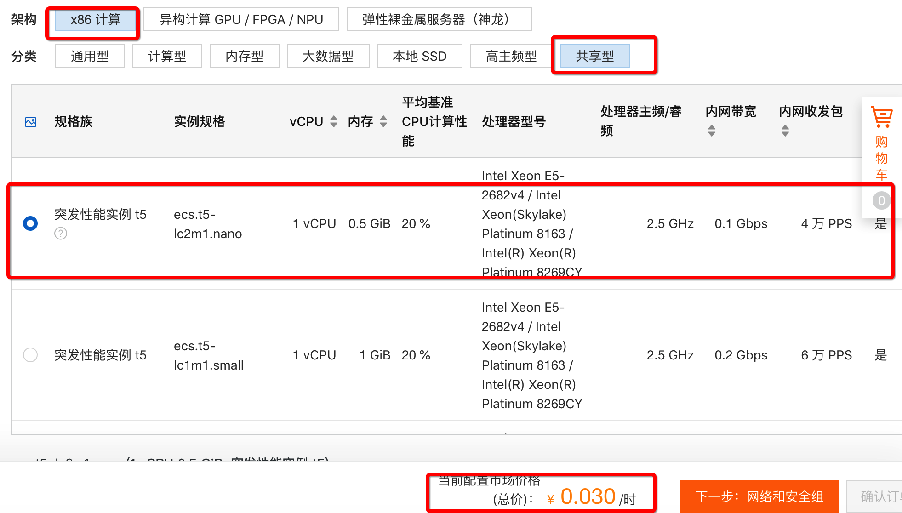
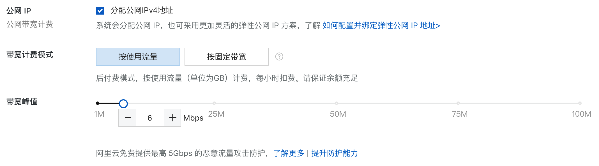
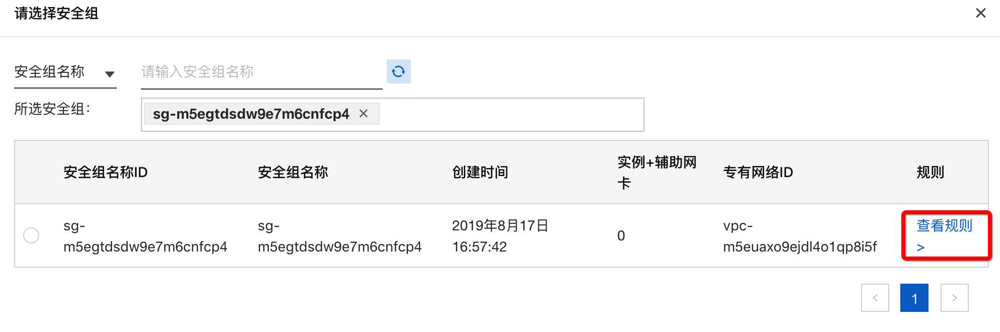
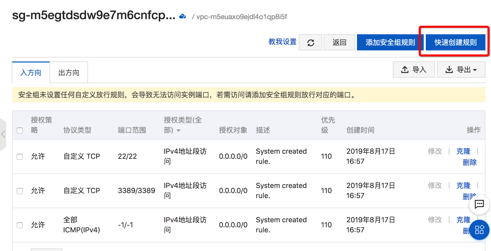
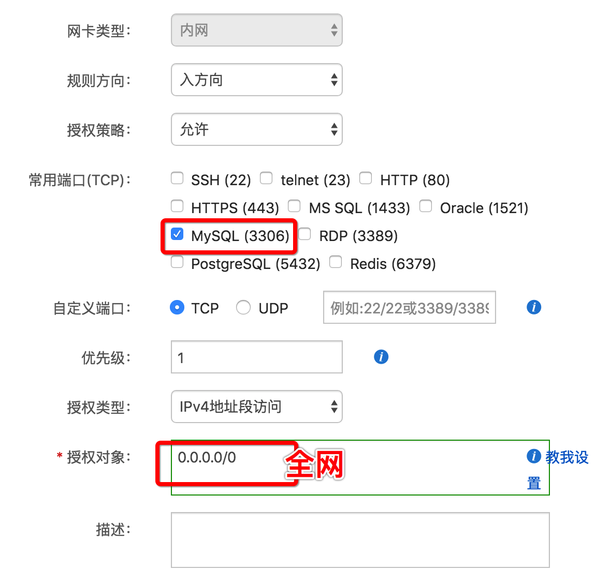
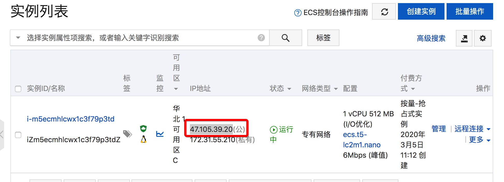
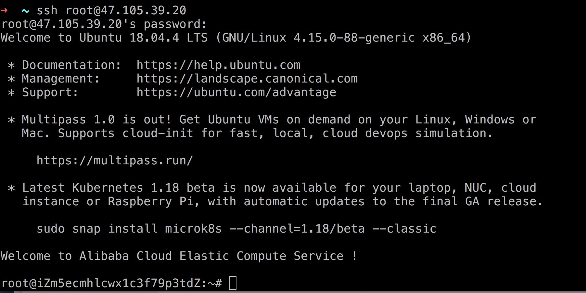
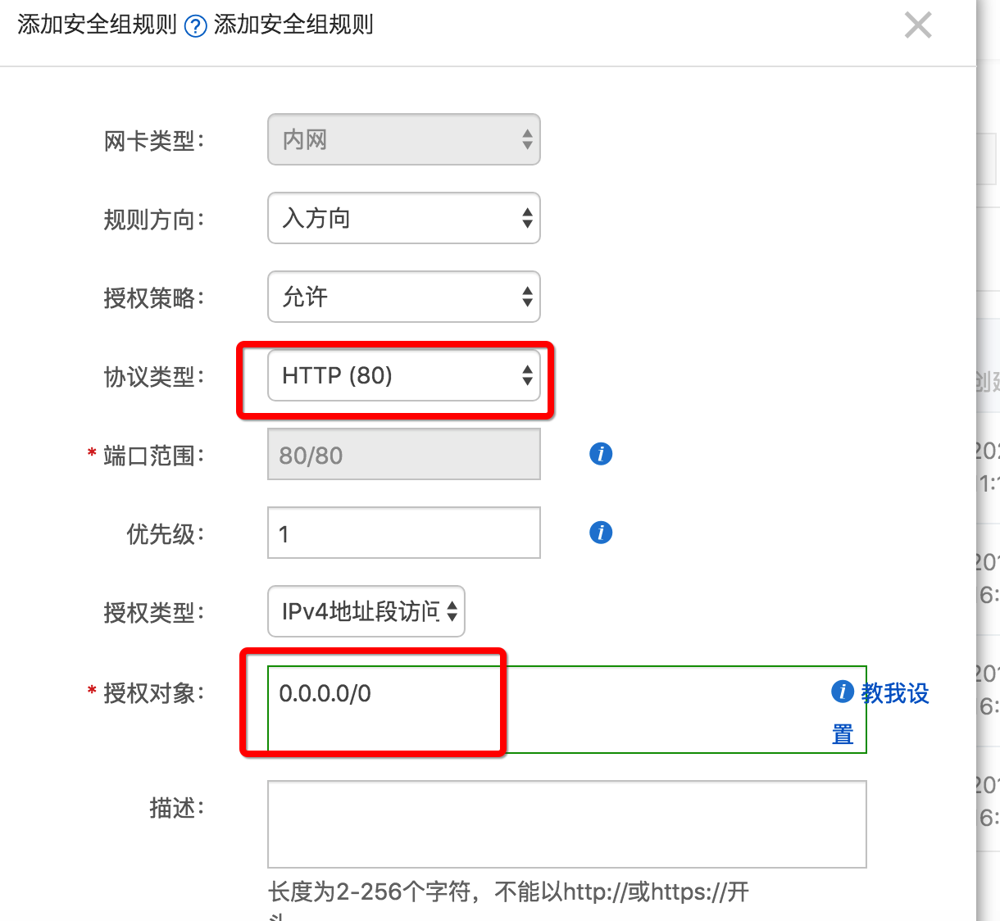
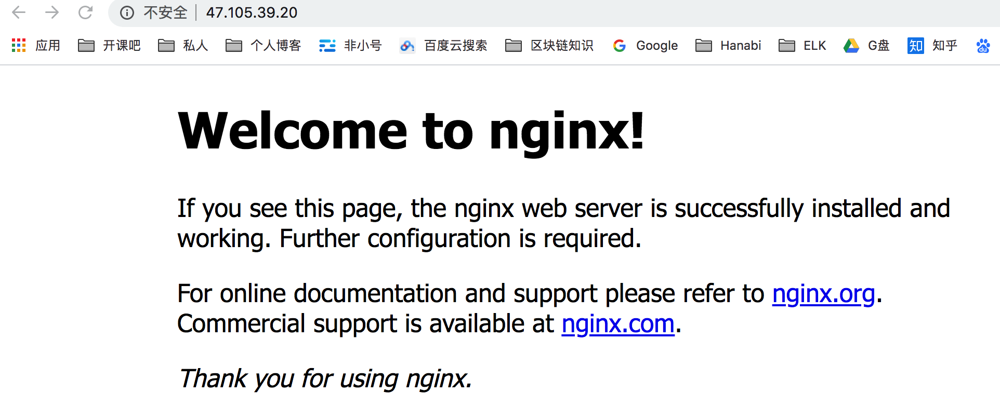

## 阿里云使用指南

## ECS服务器

### 进入管理界面



### 选择服务器配置

为了省钱 选择抢占式实例 中的最低配置





### 网络设置



### 安全组配置









### 启动实例






## APT软件管理

```bash
vi .ssh/authorized_keys
~ cat .ssh/id_rsa.pub

```


apt软件

```
apt update


```


安装mysql

```bash
#移除之前安装的mysql
sudo apt-get --purge remove mysql-server mysql-common mysql-client

#安装mysql-server
sudo apt-get install mysql-server mysql-common mysql-client


#更改mysql root账户认证模式
mysql
select user, plugin from mysql.user;
update mysql.user set authentication_string=PASSWORD('密码'), plugin='mysql_native_password' where user='root';
flush privileges;
exit

##example
mysql
select user, plugin from mysql.user;
update mysql.user set authentication_string=PASSWORD('kaikeba'), plugin='mysql_native_password' where user='root';
flush privileges;
exit

#重启mysql-server
service mysql restart

#配置root远程登陆
mysql
grant all on *.* to root@'%' identified by '密码' with grant option;
flush privileges;
exit

##example
mysql -u root -pkaikeba
grant all on *.* to root@'%' identified by 'kaikeba' with grant option;
flush privileges;
exit


#修改侦听地址127.0.0.1为0.0.0.0
vi /etc/mysql/mysql.conf.d/mysqld.cnf
bind-address = 0.0.0.0


```


### 远程登录验证

```bash
mysql -h 47.105.39.20 -u root -pkaikeba
```


## Nginx安装

```bash

apt-get install nginx
```


添加安全组规则






- 
- gzip
- 缓存优化

Node安装

