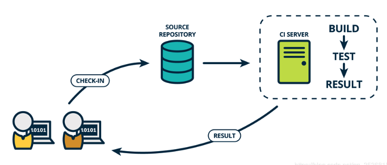
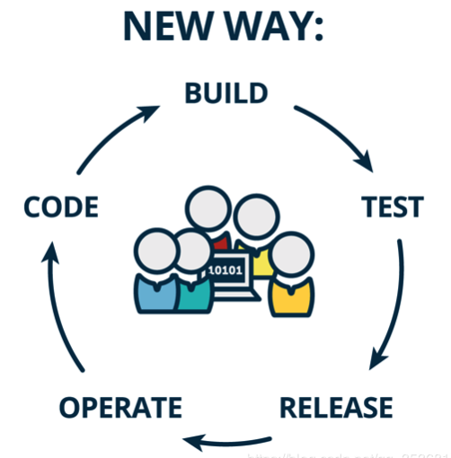

# 三分钟搞定Vuepress持续集成(利用Github Action)

> 参考资料
>
> [官方API](https://help.github.com/en/actions/reference/workflow-syntax-for-github-actions#onschedule)
>
> [Docker部署](https://imagician.net/archives/18/)

## 什么是持续集成CI



### 概念

持续集成是一种软件开发实践，即团队开发成员经常集成他们的工作，通常每个成员每天至少集成一次，也就意味着每天可能会发生多次集成。每次集成都通过自动化的构建（包括编译，发布，自动化测试）来验证，从而尽早地发现集成错误。

总之就是用程序自动完成编译、回归测试、发布等步骤。

> [阮一峰持续集成](http://www.ruanyifeng.com/blog/2015/09/continuous-integration.html)

另外简单提提两个和CI一通提起的概念

### CD 

持续交付/持续部署

通过自动化部署的手段将软件功能频繁的进行交付。
与持续交付以及持续集成相比，持续部署强调了通过 **automated deployment** 的手段，对新的软件功能进行集成。

### DevOps



DevOps 一词本身是对于 development 以及 operation 两个词的混合，其目的在于缩短系统开发的生命周期，在这过程中发布特性、修复bug以及更新均被紧密的结合。
听起来似乎有点玄乎，可以这样理解：DevOps 也即是促使开发人员与运维人员之间相互协作的文化。
DevOps 的概念似乎与持续交付的概念有些类似，两者均旨在促进开发与运维之间的协作，但是实际上两者差别很大：DevOps 更偏向于一种文化的构建，在 DevOps 文化指导下，团队中将包含了具有不同技能的人员（开发、测试等），并通过自动化测试与发布的手段，更快、更高质量的生产软件。


## 什么是GitHub Actions

GitHub Actions是Github官方提供的CI工具。

实际上持续集成概念本质上就是一个自动化处理的工作流。


Workflow  >  Job   >   Step   >   Action

- Workflow
  - 由一个或多个Job组成
  - 可以通过[事件](https://help.github.com/cn/actions/automating-your-workflow-with-github-actions/events-that-trigger-workflows)进行计划或激活
  - 你可以在存储库中设置一个可配置的自动化过程，以在GitHub上构建，测试，打包，发布或部署任何项目

- Job 
  - 由Step构成
  - 可以定制依赖关系规则
  - 可以并行运行

- Step 
  - Job执行的一组任务
  - 在同一运行程序中执行
  - 文件系统共享信息
  - 运行命令或action

- Action
   - 工作流中最小的可移植构建块
   
   - 你可以创建自己的动作，使用从[GitHub社区共享的action库](https://github.com/marketplace?utf8=✓&type=actions&query=deploy)，以及自定义公共action库。
   
     

```yaml
# main.yml
# 一个 workflow，名字为Github Action Example
name: Github Action Example
on:
  push:
    branches:
      - master
jobs:
    build:
        # runs-on 指定job任务运行所需要的虚拟机环境(必填字段)
        runs-on: ubuntu-latest
        steps:
            # action命令，切换分支获取源码
            - name: Checkout
                # 使用action库  actions/checkout获取源码
                uses: actions/checkout@master
            # action命令，安装Node10
            - name: use Node.js 13.2.0
                # 使用action库  actions/setup-node安装node
                uses: actions/setup-node@v1
                with:
                    node-version: 13.2.0
            # action命令，install && test
            - name: npm install and test
                # 运行的命令或者 action
                run: |
                    npm install
                    npm run build
                # 环境变量
                env:
                    CI: true
- name: Deploy
        uses: easingthemes/ssh-deploy@v2.0.7
        env:
          SSH_PRIVATE_KEY: ${{ secrets.ACCESS_TOKEN }}
          ARGS: "-avz --delete"
          SOURCE: "[Current File Dir]"
          REMOTE_HOST: "[Domain]"
          REMOTE_USER: "[UserName]"
          TARGET: "[Server Dir]"

```

## 实战Vuepress持续集成

```
name: VuePress to Aliyun

on:
  push:
    branches: [ master ]
  pull_request:
    branches: [ master ]

jobs:
  build:
    runs-on: ubuntu-latest
    steps:
    # 下载代码
    - uses: actions/checkout@v2
    # 安装Nodejs
    - name: Setup Node.js 13.2.0
      uses: actions/setup-node@v1
      with:
        node-version: 13.2.0
    # 安装依赖和编译
    - name: Npm install and build
      # 运行的命令或者 action
      run: |
        npm install
        npm run build
    # 部署到阿里云
    - name: Deploy to Aliyun
      uses: easingthemes/ssh-deploy@v2.1.1
      env:
        SSH_PRIVATE_KEY: ${{ secrets.SSH_PRIVATE_KEY }}
        ARGS: "-avzr --delete"
        SOURCE: "vuepress/.vuepress/dist"
        REMOTE_HOST: "47.98.252.43"
        REMOTE_USER: "root"
        TARGET: "/root/vuepress"
```


设置配置项

ssh公钥

https://github.com/marketplace/actions/ssh-deploy#configuration


