> 参考资料
> - [廖雪峰Git教程](https://www.liaoxuefeng.com/wiki/896043488029600)
> - [图解Git](https://marklodato.github.io/visual-git-guide/index-zh-cn.html)
> - [Git异常处理方案](https://juejin.im/post/5edcf3a36fb9a047fa04fbc3)


## 版本控制是什么
### 概念

版本控制最主要的功能就是追踪文件的变更。它将什么时候、什么人更改了文件的什么内容等信息忠实地了记录下来。每一次文件的改变，文件的版本号都将增加。除了记录版本变更外，版本控制的另一个重要功能是并行开发。软件开发往往是多人协同作业，版本控制可以有效地解决版本的同步以及不同开发者之间的开发通信问题，提高协同开发的效率。并行开发中最常见的不同版本软件的错误(Bug)修正问题也可以通过版本控制中分支与合并的方法有效地解决。


### 论必要性
- 单人单功能开发 --  至少你需要在开发在发现思路错误时快速退回到上一个正确的还原点
- 单人多功能并行 + Bug fix -- 需要灵活的在多个功能点分支和Bug解决分支间切换
- 多人多功能点 -- 需要多人间同步最新工作成果
- 多人多功能点多版本多基线 -- 需要使用不同分支和Tag标识开发版本和里程碑，并且通过配置管理员将新的Feather和Bug Fix配置到不同的版本。


### 基础功能
- 检入(Checkin)检出(Checkout)控制
- 分支合并
- 历史记录

### 常见工具
- CVS -- Dick Grune在1984年～1985年基于RCS开发的一个客户一服务器架构的版本控制软件，长久以来一直是免费版本控制软件的主要选择。
- SVN -- SVN是一个比较好的开源版本控制工具
- Git -- 今天的主题


## Git的历史


> 引用：廖雪峰的资料
>
> 很多人都知道，Linus在1991年创建了开源的Linux，从此，Linux系统不断发展，已经成为最大的服务器系统软件了。
> Linus虽然创建了Linux，但Linux的壮大是靠全世界热心的志愿者参与的，这么多人在世界各地为Linux编写代码，那Linux的代码是如何管理的呢？
> 事实是，在2002年以前，世界各地的志愿者把源代码文件通过diff的方式发给Linus，然后由Linus本人通过手工方式合并代码！
> 你也许会想，为什么Linus不把Linux代码放到版本控制系统里呢？不是有CVS、SVN这些免费的版本控制系统吗？因为Linus坚定地反对CVS和SVN，这些集中式的版本控制系统不但速度慢，而且必须联网才能使用。有一些商用的版本控制系统，虽然比CVS、SVN好用，但那是付费的，和Linux的开源精神不符。
> 不过，到了2002年，Linux系统已经发展了十年了，代码库之大让Linus很难继续通过手工方式管理了，社区的弟兄们也对这种方式表达了强烈不满，于是Linus选择了一个商业的版本控制系统BitKeeper，BitKeeper的东家BitMover公司出于人道主义精神，授权Linux社区免费使用这个版本控制系统。
> 安定团结的大好局面在2005年就被打破了，原因是Linux社区牛人聚集，不免沾染了一些梁山好汉的江湖习气。开发Samba的Andrew试图【破】【解】BitKeeper的协议（这么干的其实也不只他一个），被BitMover公司发现了（监控工作做得不错！），于是BitMover公司怒了，要收回Linux社区的免费使用权。
> Linus可以向BitMover公司道个歉，保证以后严格管教弟兄们，嗯，这是不可能的。实际情况是这样的：
> Linus花了两周时间自己用C写了一个分布式版本控制系统，这就是Git！一个月之内，Linux系统的源码已经由Git管理了！牛是怎么定义的呢？大家可以体会一下。
> Git迅速成为最流行的分布式版本控制系统，尤其是2008年，GitHub网站上线了，它为开源项目免费提供Git存储，无数开源项目开始迁移至GitHub，包括jQuery，PHP，Ruby等等。
> 历史就是这么偶然，如果不是当年BitMover公司威胁Linux社区，可能现在我们就没有免费而超级好用的Git了。

## 安装
### Linux
```bash
sudo apt-get install git
```
### Mac
首先安装homebrew，然后通过homebrew安装Git，具体方法请参考homebrew的文档：http://brew.sh/。
```bash
brew install 
````
### Windows
首先安装Liunx子系统，然后参考Linux安装指南


## 本地版本
### 创建本地仓库
创建仓库的过程其实就是将一个普通的文件夹升级为一个具备版本控制能力的文件夹
```bash
# 创建文件夹
mkdir hello-git
# 改变工作目录到hello-git
cd hello-git
# 初始化Git相当将文件夹升级为仓库
git init
```

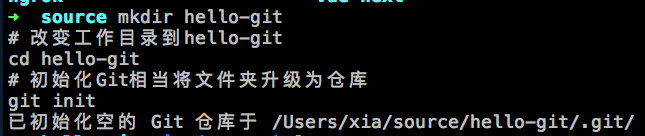

实际上git命令会在文件夹下创建一个.git文件夹所有后面神奇的版本控制功能都是通过这个文件夹里面的这些神奇的文件实现的。
我们可以通过事先仰望一下后面用到了会给大家一一解析
```bash
tree -a
```

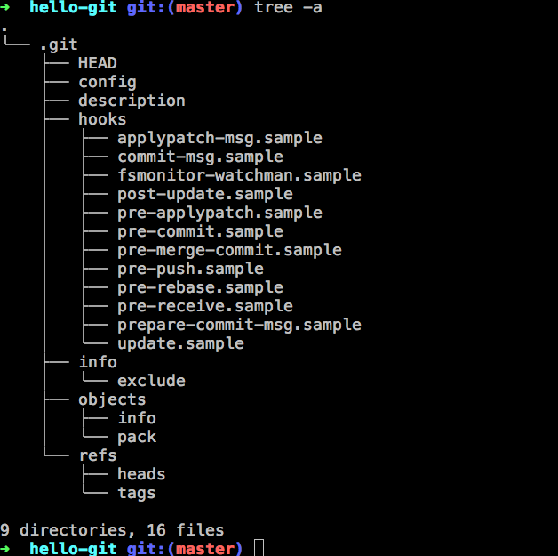


### 将文件添加到版本库
首先我们创建一个文件
```bash
# 创建一个文件
echo 'Step01 Create File' >> README.md
```
然后我们查看一下版本哭的状态
``` bash
git status
```

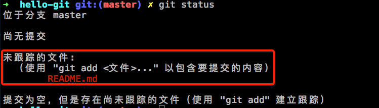
我们会发现Git会提示我们这个文件属于未跟踪文件
如果在Vscode中

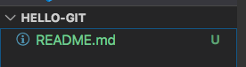
文件也会用绿色表示

其实Git的版本控制的要求也就是说即使处于版本库文件夹内的文件你也要明确的声明需要版本控制功能git才会跟踪他的版本变化。这样的白名单做法是为了防止多一些诸如编译结果文件，日志文件，开发工具本地配置等完全没有必要进行版本控制的文件进行了跟踪占用没必要的系统资源。

#### 将文件添加到版本库
```bash
git add README.md
```

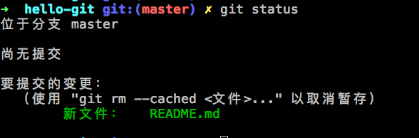


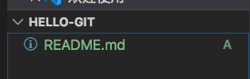

添加完成后我么你发现这个时候文件状态变为要提交状态。
这是因为相对于旧的版本记录Git发现新添加了一个文件。我们试用git status就可以看到这样的提示。

#### 从暂存中恢复文件
一旦文件被提交到版本库实际上Git就会将README文件的快照已经缓存了一份到暂存盘，如果有需要你还可以将这个镜像取出来。不信的话我们可以做一个小实验。

```
# 删除文件
rm -f README.md
# 从缓存区检出文件
git checkout README.md
# 查看文件
cat README.md

```

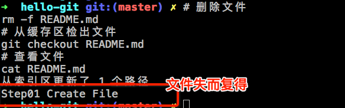


另外如果你想一次添加多个和放弃跟踪可以参考下面的方法

#### 添加多个文件跟踪
```bash
# 添加本目录下文件具备递归文件夹功能
git add .
```

#### 取消跟踪
```bash
# 取消添加
git rm --cached README.md
```

#### 忽略文件.gitignore

如果你希望在使用 add .的时候忽略某一个文件可以在目录下创建一个
.gitignore文件
```bash
#.gitignore
# 忽略dist.js
dist.js
```
这个时候就可以让git文件放弃对此文件的关注。
当然如果你曾经将忽略的文件天交到git的跟踪列表中的话，即使你你在ignore文件中声明了git也不会主动放弃跟踪


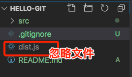


### 提交代码commit
提交代码是指已经完成了某一阶段的代码开发比如你完成了某一个代码功能(features)或者修改了某一个代码缺陷(fix),你就可以创建一次代码提交。


```bash
git commit -m 'add README.js'

```
提交的本质是讲原有工作区的代码提交到本地仓库中，我们看一下提交前后的对比。
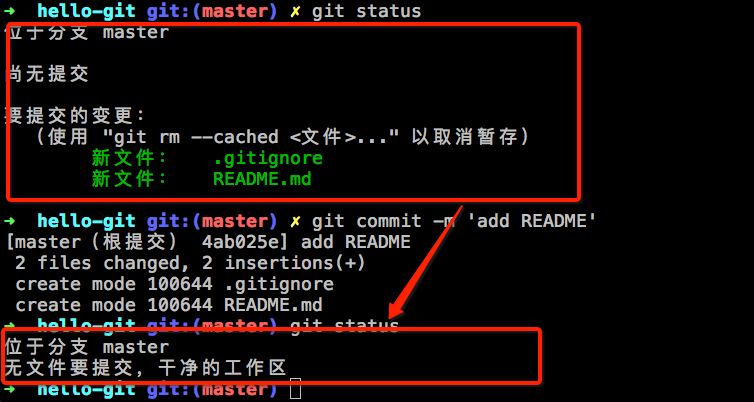

### 保存临时工作成果Stash
在你需要并行做好几件事的时候，比如你正在开发一个功能程序开发到一半，有一个紧急的bug需要处理又或者你突然对另外一个新特性来了思路，但是你现有的代码还在一个中间状态甚至编译都有问题。你需要可定需要一个功能保存现在的工作现场，然后去干另外一件事。这个时候stash功能就可以帮助你解决。

```bash
# 建立一个临时的工作成果
echo 'TEMP xxxx' >> README.md

# 保存工作现场到栈
git stash

# 从栈中弹出工作现场
git stash pop


```

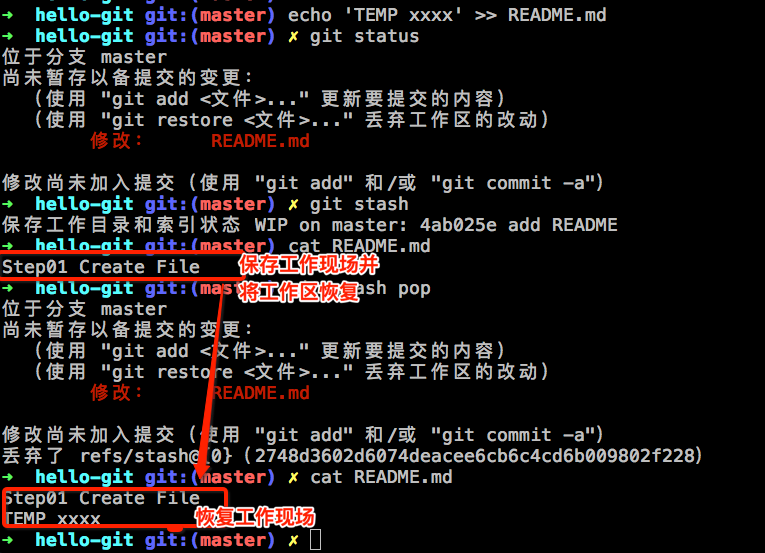

### 放弃修改
```bash
git restore .
```


### 回退到上一个提交
首先我们修改一下文件，再做一次提交
```
echo 'STEP02 ADD FUN01' >> README.md
# 参数-a 是先添加到缓冲区再提交的意思
git commit -am 'README ADD STEP02'
```
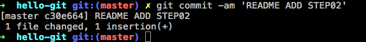

这个时候我们会有两个提交记录
我们可以用git log检查一下
```bash
git log
git log –-oneline # 简短日志
git reflog # 操作记录 包括回退记录也会被显示
```

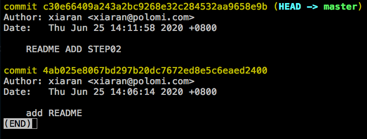

```bash
# 只是版本回退 不更新工作区
git reset HEAD^

# 不但版本回退 也会更新工作区（文件目录）的文件到上一个版本
git reset --hard HEAD^

```

### 工作区(Working Directory)、缓存区(Stage)、版本库(Repository)小结

- 工作区 --- 就是文件目录因为你的开发工作就是对文件的修改所以叫做工作区
- 缓存区 --- 没有提交前也就是没有完成完成工作结果代码保存的地方
- 版本库 --- 每一个工作结果的时间带会被按照不同的提交记录保存起来


## 分支管理
如果你每次只开发一个功能点或者修改一个Bug。不需要并行开发的可能你不需要分支。不过现实情况是很有可能你正在开发一个长达几天的新特性时你又不的不去修改一些紧急的bug，又或是有个小伙伴急着让你帮助他解决他所遇到的问题。这就有点像你需要不断的从不同进度点开始玩游戏。这个时候分支就可以帮我们解决这个问题。
git的分支管理在所有的版本控制工具中出类拔萃分厂推荐大家使用分支功能。

### 创建分支开发
默认情况下我们会处于master分支，在开始开发前我们首先要做的就是切分一个新的分支。比如开发一个叫做FunA的功能点。

```bash
# 分支A
# 创建分支并切换分支到funA
git checkout -b 'funA'
# 完成功能
echo 'FunA XXXXXXX' >> README.md
# 提交功能
git commit -am 'funA add'
# 检出master分支
git checkout master
# 合并将开发分支合并到主分支
git merge funA
# 可以利用-d合并的同时删除分支
git merge -d funA

```
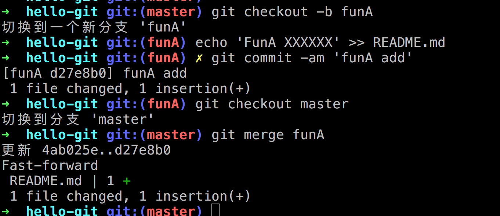

### 分支的查看、删除
```bash
# 查看
git branch 
# 查看 - a 包括远程分支
git branch -a
# 删除
git branch -D <分支名称>

```


### 冲突解决
假设两个分支都针对同一行代码进行修改，就会造成冲突，需要人工确定那一个分支得到保留。
就好比两个人一个主张走A路线，另一个主张走B路线。最后需要再合并的时候决定到底走哪个路线。

首先我们先制造这样一个冲突，假设我们将开启连个分支 分别将README文件的第一行 做不同而修改
- step01 ： Step01 Create File AAA
- step01 ： Step01 Create File BBB

```bash
# 创建分支并切换分支到funA
git checkout master
git checkout -b 'funA'
echo 'STEP01 AAA' > README.md
git commit -am 'step01 AAA'

# 创建分支并切换分支到
git checkout -b 'funB'
echo 'STEP01 BBB' > README.md
git commit -am 'step01 BBB'


# 可以利用-d合并的同时删除分支
git checkout master
git merge -d funA
git merge -d funB

```
由于对同一行代码进行了修改这个时候Git就需要人工区合并代码
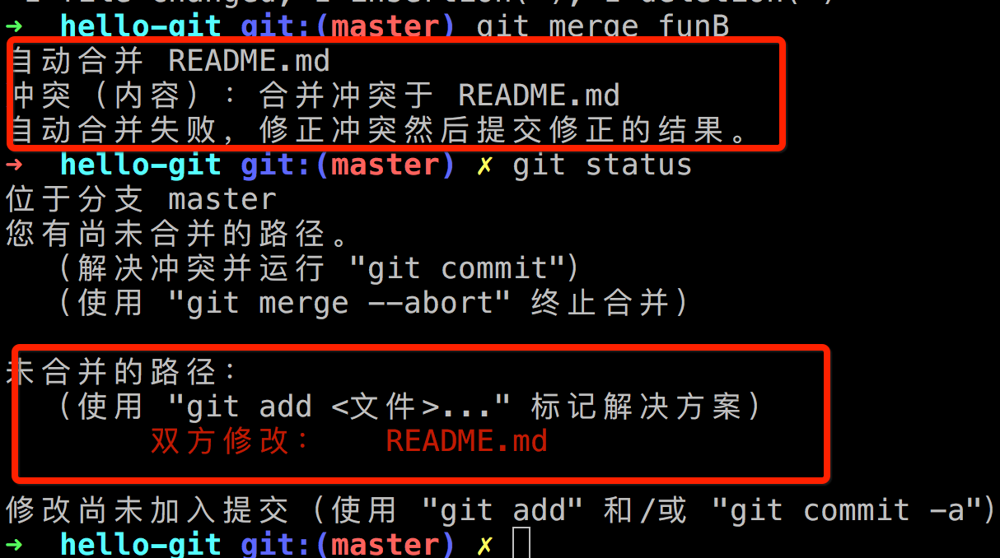


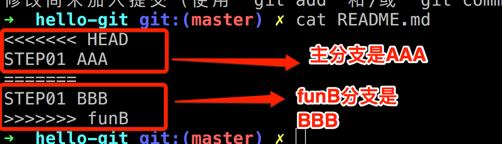

如果在VSCode编辑器中会更加清晰一些

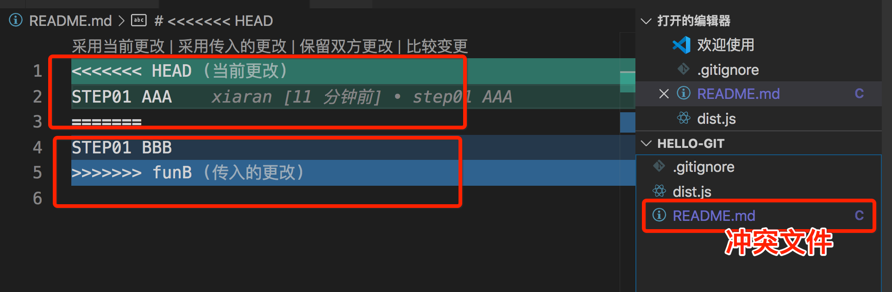

下面要做的就是人工保留你需要的部分，
然后进行一次merge提交。其实取舍AAA还是BBB本身就是一次变更所以其实就是一次的代码commit。
```bash
git commit -am 'Merge branch funB'
```

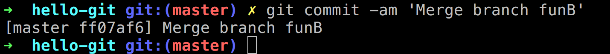

最后我们可以通过log看一下这次合并过程
```bash
git log --graph --pretty=oneline --abbrev-commit
```

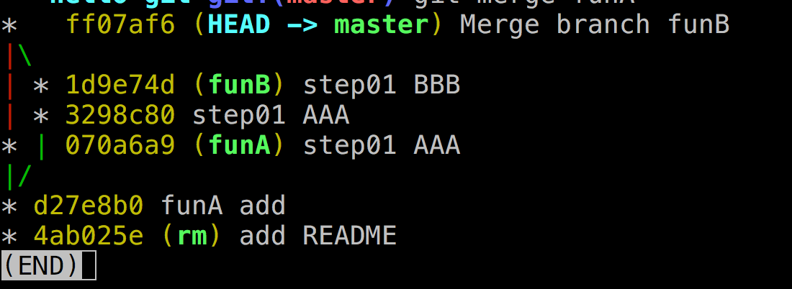


### 清洗提交历史 -- squash方式合并
如果你的分支开发历经各种磨难，里面有很多细节的功能进展你不希望其他人了解，又或者你在开发的过程中肚子饿了，希望通过一次的commit来保留中间成果。但是最终提交的时候不希望你的这些中间细节被被人了解，可以采用这样的办法
```bash
# 创建分支并切换分支到funA
git checkout master
git checkout -b 'funA'
echo 'STEP02 BBB' >> README.md
git commit -am 'FunA commit 01'
echo 'STEP03 BBB' >> README.md
git commit -am 'FunA commit 02'

# 切换master分支
# 使用squash方式提交 只合并不commit
git merge --squash funA
```
这个时候我们可以用git status查看一下发现合并代码后并没有提交。只是将所有的提交都整合到了一起放在暂存区。
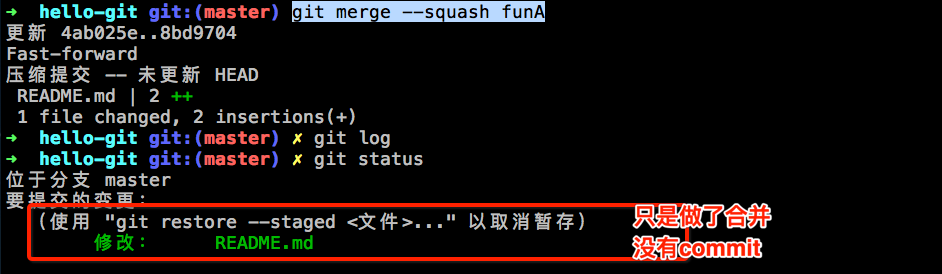

```bash
# 创建分支并切换分支到funA
git commit -am 'funA update'
```
这个时候我们可以使用commit方式进行提交留下光辉的而干净的一笔。
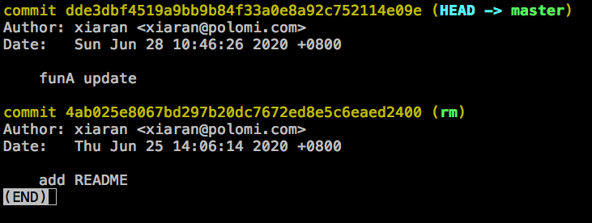


### Rebase变基操作
去除版本合并痕迹 （待续）


### 其他命令总结
```bash
# 删除分支
git branch -D <branch_name>
```


## 标签管理
标签管理就是给自己的代码打上版本标记。其实就是给自己的版本设置里程碑。
```bash
# 将最新提交打标签
git tag v1.0

# 将指定commit打标签
git tag v0.9 4ab025

# 查看打标签
git tag 

# 查看与某标签之间的差距
git show v0.9
```

## 远程仓库GitHub
### 如何获取远程仓库
- GitHub 世界上最大的开源社区
- Gitee 国内的速度快
- 自己搭建Gitlab
（后续会教大家如何一行配置搞定gitlab搭建）


### git建立远程仓库

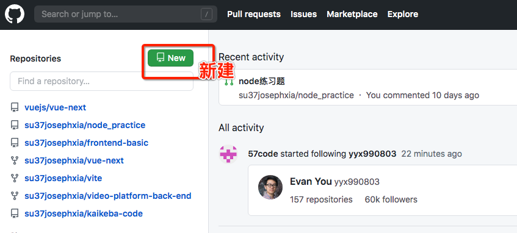


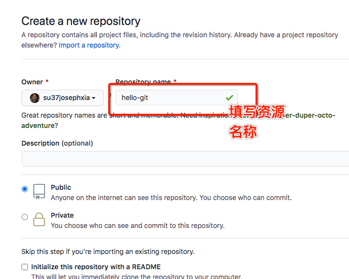


另外与远程资源库通讯通常采用ssh协议，所以需要将你的ssh公钥添加到github账户中

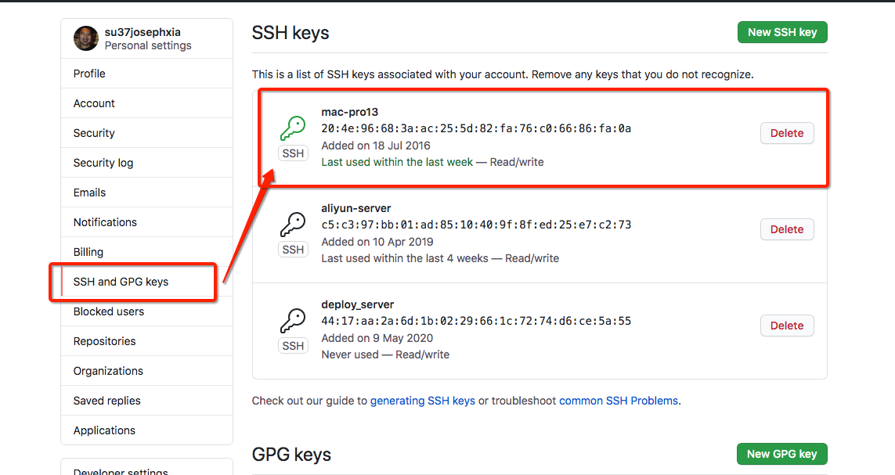
获取公钥的方法可以参考
[公钥获取方法](https://www.josephxia.com/document/server/Linux%E5%91%BD%E4%BB%A4.html)

### 添加远程分支
```
# 添加远程分支
git remote add origin git@github.com:su37josephxia/hello-git.git

```

### 查看
```bash
git remote -v
```


### 推送 push
```bash
git push
```

### 拉去 fetch
```bash
git fetch
# 如果有多个远程源时
git fetch <拉去源>
```

### 拉去 pull
相当与先fetch + merge
```bash
git pull
```

### GitHub之Watch
表示关注、这个项目的所有动态包括PR ISSUE你的信息中心和邮箱都会收到。

### GitHub之Star
表示点赞、表示对这个项目支持。
https://github.com/su37josephxia/frontend-basic 
Star一下我这个项目。

### GitHub之Fork
相当于复制了目前项目的文件，后续变化必须手动更新。
手动更新方法如下：

```bash
# 本地新加一个新的远程库upstream
git remote add upstream https://github.com/vuejs/vue-next

```

```bash
# 从远程仓库拉去代码
git fetch upstream
# 切换分支
git chekout master
# 合并远程分支
git merge upstream/master
```